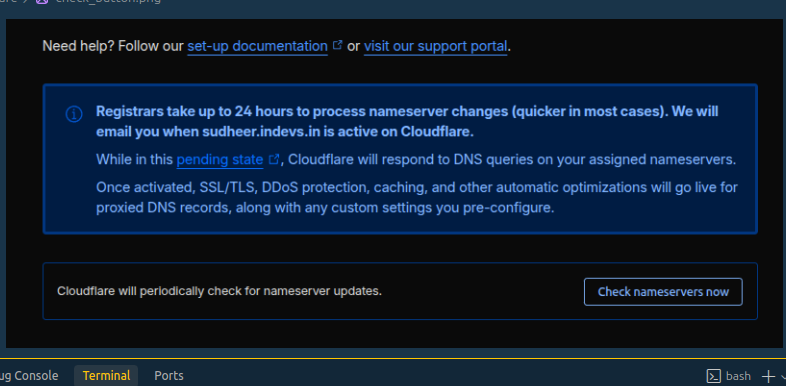

# Cloudflare DNS Setup for Stackryze Domains

> [!WARNING]
> These docs are in **Beta** and actively updated daily. Please report if you find any issues.

This guide shows you how to use Cloudflare as your DNS provider for your **Stackryze Domains** subdomain.

## Why Cloudflare?

- **Free Forever**: No cost for DNS hosting
- **Fast Global Network**: 300+ data centers worldwide
- **DDoS Protection**: Built-in security features
- **Free SSL**: Automatic HTTPS for your subdomain
- **Easy to Use**: Intuitive dashboard
- **API Access**: Automate DNS management

---

## Prerequisites

Before you begin:

- ✅ **Registered subdomain** on [domain.stackryze.com](https://domain.stackryze.com/)
- ✅ **Cloudflare account** (free) - [Sign up here](https://cloudflare.com)

> [!TIP]
> If you haven't registered your subdomain yet, see our [Getting Started](../getting-started) guide first.

---

## Step 1: Add Your Subdomain to Cloudflare

1. Log in to your [Cloudflare dashboard](https://dash.cloudflare.com/)
2. Click **"Add a Site"**


3. Enter your **full subdomain**: `yourname.indevs.in`
4. Click **"Continue"**


> [!IMPORTANT]
> Enter your complete subdomain (e.g., `myproject.indevs.in`), not just the base domain.

---

## Step 2: Select Free Plan

1. Select the **Free** plan
2. Click **"Continue"**


> [!NOTE]
> The Free plan includes everything you need for DNS hosting. You can upgrade later if needed.

---

## Step 3: Copy Your Cloudflare Nameservers

Cloudflare will assign unique nameservers to your domain:

1. Look for the nameserver information on screen
2. You'll see something like:
   ```
   ava.ns.cloudflare.com
   curt.ns.cloudflare.com
   ```
3. **Copy both nameservers** - you'll need them in the next step


> [!WARNING]
> Your nameservers will be different from this example. Copy the exact ones Cloudflare assigns to you.

**How to find nameservers later:**
- Go to **DNS** → **Records** in Cloudflare
- Scroll to the **Cloudflare Nameservers** section
- Or check the **Overview** tab


---

## Step 4: Update Nameservers in Stackryze Domains

Now update your domain to use Cloudflare:

1. Go to **[domain.stackryze.com](https://domain.stackryze.com/)**
2. Navigate to **"My Domains"**
3. Click on your domain
4. Click **"Update Nameservers"** or **"Edit"**
5. Replace the nameservers with your Cloudflare ones:
   - Nameserver 1: `ava.ns.cloudflare.com`
   - Nameserver 2: `curt.ns.cloudflare.com`
6. Click **"Save"**

> [!IMPORTANT]
> DNS changes typically propagate in 5-10 minutes, but can take up to 48 hours globally.

---

## Step 5: Verify Connection

1. Return to your Cloudflare dashboard Overview page.
2. Click **"Check nameservers now"** to initiate a check.



3. Cloudflare will verify your nameservers. This usually takes a few minutes but can take up to 24 hours.
4. **Email Confirmation**: Cloudflare will send you an email confirmation once your site is active.
5. When successful, you will see a confirmation message:


---

## Step 6: Configure DNS Records

Now add your DNS records in Cloudflare:

1. In Cloudflare, go to **DNS** → **Records**


2. Click **"Add record"**
3. Configure your records based on your needs:


**Example: Point to GitHub Pages**
- **Type**: CNAME
- **Name**: @ (or your subdomain)
- **Target**: yourusername.github.io
- **Proxy status**: DNS only (gray cloud)
- **TTL**: Auto

**Example: Point to an IP Address**
- **Type**: A
- **Name**: @
- **IPv4 address**: 192.0.2.1
- **Proxy status**: DNS only (gray cloud)
- **TTL**: Auto

**Example: Add WWW Subdomain**
- **Type**: CNAME
- **Name**: www
- **Target**: yourname.indevs.in
- **Proxy status**: DNS only (gray cloud)
- **TTL**: Auto

---

## Step 7: Enable SSL (Optional but Recommended)

Once your domain is live:

1. In Cloudflare, go to **SSL/TLS**
2. Set SSL mode to **Full** or **Full (strict)**
3. Enable **Always Use HTTPS**

> [!TIP]
> SSL certificates are automatically provisioned. This can take up to 24 hours.

---

## Cloudflare Features

### Proxy Status (Orange Cloud vs Gray Cloud)

- **Gray Cloud (DNS Only)** - Recommended initially
  - DNS resolution only
  - No Cloudflare caching or protection
  - Required for some services (email, etc.)

- **Orange Cloud (Proxied)** - Optional
  - Traffic goes through Cloudflare
  - DDoS protection and caching
  - May cause issues with some services

> [!IMPORTANT]
> Start with gray cloud (DNS only) until your domain is working, then experiment with proxying if needed.

---

## Common Issues

### Nameservers Not Showing

**Solution**: Wait a few minutes after adding your site. Cloudflare needs to provision nameservers.

### DNS Not Resolving

**Solution**: 
- Verify nameservers are correctly updated in your Stackryze dashboard
- Wait 5-10 minutes for DNS propagation
- Check DNS records in Cloudflare
- Use [DNS Checker](https://dnschecker.org/) to verify

### SSL Errors

**Solution**:
- Ensure your origin server supports HTTPS
- Set SSL mode to **Flexible** if your origin doesn't have SSL
- Wait up to 24 hours for certificate provisioning

### Domain Not Working After Setup

**Solution**:
- Verify nameservers in Stackryze dashboard match Cloudflare
- Check DNS records in Cloudflare
- Clear browser and DNS cache
- Wait up to 48 hours for full propagation

---

## Advanced Features

- **Page Rules**: Custom caching, redirects, and more
- **Workers**: Serverless code at the edge
- **Analytics**: Traffic statistics and insights
- **API Access**: Automate DNS management

---

## Additional Resources

- [Cloudflare Documentation](https://developers.cloudflare.com/)
- [Cloudflare Community](https://community.cloudflare.com/)
- [DNS Propagation Checker](https://dnschecker.org/)

---

**Need help?** [Join our Discord](https://discord.gg/wr7s97cfM7) for live help or contact us at [support@stackryze.com](mailto:support@stackryze.com)
