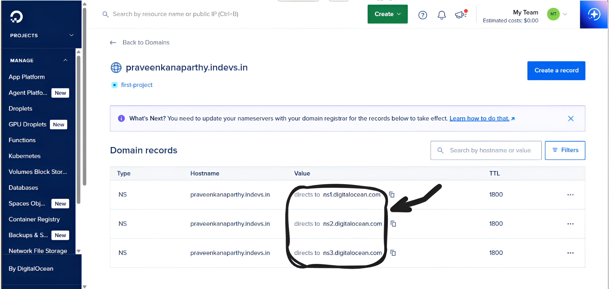
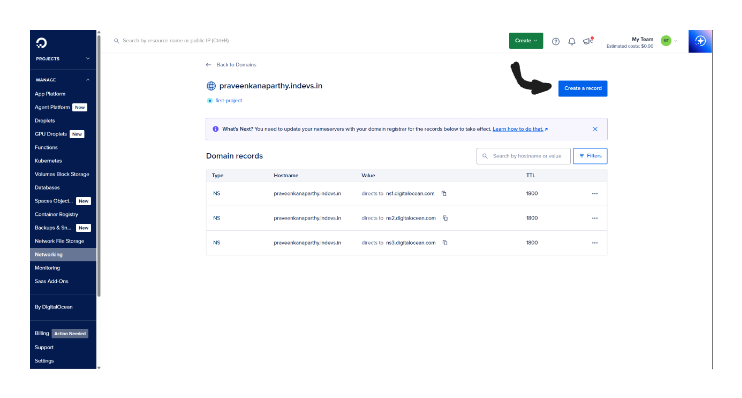

# DigitalOcean DNS Setup for Stackryze Domains

> [!WARNING]
> These docs are in **Beta** and actively updated daily. Please report if you find any issues.

This guide shows you how to use DigitalOcean DNS as your DNS provider for your **Stackryze Domains** subdomain.

## Why DigitalOcean DNS?

- **Free DNS Hosting**: Included with any DigitalOcean account
- **Simple Interface**: Easy-to-use control panel
- **Reliable Infrastructure**: Built on DigitalOcean's global network
- **Fast Propagation**: Quick DNS updates
- **API Access**: Automate DNS management

---

## Prerequisites

Before you begin:

- **Registered subdomain** on [domain.stackryze.com](https://domain.stackryze.com/)
- **DigitalOcean account** - [Sign up here](https://www.digitalocean.com/)

> [!TIP]
> If you haven't registered your subdomain yet, see our [Getting Started](../getting-started) guide first.

---

## Step 1: Login to DigitalOcean Dashboard

1. Log in to your [DigitalOcean Dashboard](https://cloud.digitalocean.com/)
2. Navigate to **"Networking"** in the left sidebar
3. Click on **"Networking"**

[](../media/DigitalOcean/DigitalOcean_step_1.png)

---

## Step 2: Navigate to Domains Tab

1. Click on the **"Domains"** tab
2. If this is your first time, you may need to **add a payment method**
3. Fill in your payment details/credentials to proceed
4. Once payment is set up, click **"Add a domain"** button

[](../media/DigitalOcean/DigitalOcean_step_2.png)

---

## Step 3: Add Your Domain

1. In the domain input field, enter your **full subdomain** (e.g., `yourname.indevs.in`)
2. Click **"Add Domain"** button

[](../media/DigitalOcean/DigitalOcean_step_3.png)

> [!IMPORTANT]
> Make sure to enter your complete subdomain from Stackryze Domains (e.g., `myproject.indevs.in`), not just the base domain.

---

## Step 4: Copy Your DigitalOcean Nameservers

After adding the domain, DigitalOcean will display your nameservers:

1. You'll see three nameservers like:
   ```
   ns1.digitalocean.com
   ns2.digitalocean.com
   ns3.digitalocean.com
   ```
2. **Copy all three nameservers** - you'll need them in the next step

[](../media/DigitalOcean/DigitalOcean_step_4.png)

> [!WARNING]
> Your nameservers will be the same for all DigitalOcean domains. Always use the exact values shown in your dashboard.

---

## Step 5: Update Nameservers in Stackryze Domains

Now add the DigitalOcean nameservers to your Stackryze domain:

1. Log in to [domain.stackryze.com](https://domain.stackryze.com/)
2. Update nameservers with your DigitalOcean nameservers
3. Click **"Save"**

> [!TIP]
> For detailed instructions, see [Updating Nameservers](../managing-domains#updating-nameservers) guide.

> [!IMPORTANT]
> DNS changes will be updated within 24-48 hours globally.

---

## Step 6: Create an A Record

Now add your DNS records in DigitalOcean:

1. In DigitalOcean, go to your **domain's DNS management page**
2. Click **"Create new record"** or **"Add record"** button

[](../media/DigitalOcean/DigitalOcean_step_6.1.png)

3. Select **"A"** as the record type
4. Fill in the details:
   - **Hostname**: `@` (for root domain) or your subdomain name
   - **Will Direct To**: Your server's IP address (e.g., `192.0.2.1`)
   - **TTL**: `3600` (1 hour) or your preferred value
5. Click **"Create Record"**

[](../media/DigitalOcean/DigitalOcean_step_6.2.png?v=2)

**That's it! All steps are done.** 🎉

> [!TIP]
> **Common Record Types:**
> - **A Record**: Points to an IPv4 address
> - **CNAME Record**: Points to another domain (e.g., GitHub Pages)
> - **AAAA Record**: Points to an IPv6 address
> - **MX Record**: For email routing

---

## SSL Configuration

**SSL Handling:**
- DigitalOcean DNS provides DNS services only
- SSL certificates must be managed by your hosting provider

**For Common Hosting Platforms:**
- **Vercel/Netlify**: Automatic SSL provisioning
- **GitHub Pages**: Automatic SSL after DNS verification
- **DigitalOcean App Platform**: Free automatic SSL certificates
- **Custom Server**: Use Let's Encrypt or commercial certificates

> [!TIP]
> Most modern hosting platforms provide free automatic SSL certificates once DNS is configured.

---

## Common Issues

### Domain Not Added

**Solution**:
- Verify you entered the complete subdomain
- Check that you have an active DigitalOcean account
- Ensure subdomain format is correct
- Try refreshing the page and retry

### DNS Not Resolving

**Solution**:
- Verify nameservers are correctly updated in your Stackryze dashboard
- Wait 10-30 minutes for DNS propagation
- Check DNS records in DigitalOcean
- Use [DNS Checker](https://dnschecker.org/) to verify
- Ensure all three nameservers are entered correctly

### Records Not Updating

**Solution**:
- Check TTL value - changes may be cached
- Verify record syntax is correct
- Ensure no conflicting records exist
- Wait for TTL period to expire before expecting changes

### Domain Not Working After Setup

**Solution**:
- Verify nameservers in Stackryze dashboard match DigitalOcean
- Check DNS records in DigitalOcean
- Clear browser and DNS cache
- Wait up to 48 hours for full propagation

---

## Advanced Features

- **API Access**: Manage DNS programmatically via DigitalOcean API
- **IPv6 Support**: Full support for AAAA records
- **CAA Records**: Certificate Authority Authorization
- **SRV Records**: Service records for advanced configurations
- **Bulk Operations**: Manage multiple records efficiently

---

## Additional Resources

- [DigitalOcean DNS Documentation](https://docs.digitalocean.com/products/networking/dns/)
- [DigitalOcean API Documentation](https://docs.digitalocean.com/reference/api/api-reference/#tag/Domains)
- [DNS Propagation Checker](https://dnschecker.org/)

---

**Need help?** [Join our Discord](https://discord.gg/wr7s97cfM7) for live help or contact us at [support@stackryze.com](mailto:support@stackryze.com)
