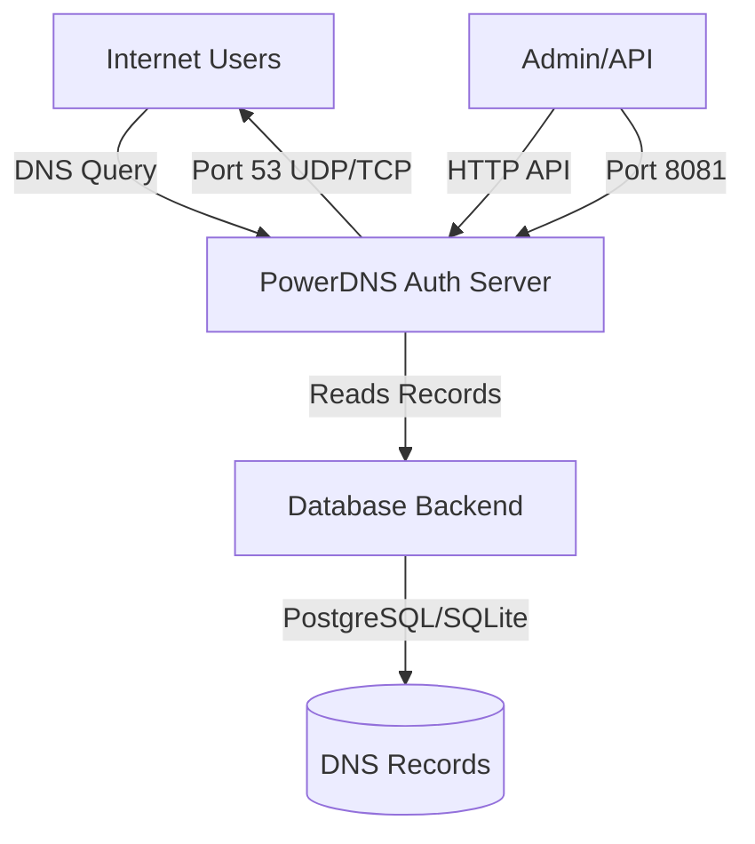

# PowerDNS Self-Hosted DNS Setup

> [!WARNING]
> These docs are in **Beta** and actively updated daily. Please report if you find any issues.

> [!CAUTION]
> **Advanced Setup - Not Recommended for Beginners**
> 
> PowerDNS is a complex, self-hosted DNS solution that requires significant technical expertise in server administration, DNS protocols, and database management. This setup is recommended only for experienced system administrators who understand DNS internals, security hardening, and high-availability infrastructure.

PowerDNS Authoritative Server is a versatile, open-source nameserver that supports multiple backends for storing DNS records. Stackryze uses PowerDNS to power **ns1.stackryze.com** and **ns2.stackryze.com**, which manage all `indevs.in` subdomains.

---

## Why PowerDNS?

- **Complete Control**: Full ownership of your DNS infrastructure
- **Multiple Backends**: PostgreSQL, SQLite, BIND zone files, and more
- **RESTful HTTP API**: Programmatic DNS management
- **High Performance**: Designed to handle millions of queries
- **DNSSEC Support**: Built-in support for DNS security extensions
- **Active Development**: Regular updates and security patches

---

## Prerequisites

Before you begin, ensure you have:

- ✅ **Linux Server(s)**: VPS or dedicated server with root access (minimum 2 servers recommended for redundancy)
- ✅ **Docker & Docker Compose**: Version 20.10.0+ recommended
- ✅ **Domain/Subdomain**: Registered on [domain.stackryze.com](https://domain.stackryze.com/)
- ✅ **Public Static IP(s)**: At least one static public IP address
- ✅ **DNS Knowledge**: Understanding of DNS zones, records, and nameserver delegation
- ✅ **Database Knowledge**: Familiarity with PostgreSQL (if using database backend)

> [!IMPORTANT]
> For production use, you need at least 2 nameservers for redundancy. This guide covers a single-server setup for learning purposes.

---

## Docker Images

PowerDNS provides official Docker images at [hub.docker.com/u/powerdns](https://hub.docker.com/u/powerdns):

| Image | Purpose | Use Case |
|-------|---------|----------|
| `powerdns/pdns-auth-48` | Authoritative DNS Server (v4.8) | Production-ready authoritative nameserver |
| `powerdns/pdns-auth-49` | Authoritative DNS Server (v4.9) | Latest stable version |
| `powerdns/pdns-auth-master` | Development Build | Testing new features (not for production) |
| `powerdns/pdns-recursor` | Recursive DNS Resolver | Caching resolver (not needed for this guide) |
| `powerdns/dnsdist` | DNS Load Balancer | Advanced load balancing |

> [!NOTE]
> For this guide, we'll use `powerdns/pdns-auth-49` as it's the latest stable authoritative server needed for subdomain delegation.

---

## Architecture Overview



---

## Installation with Docker and PostgreSQL
PostgreSQL is an excellent production database backend for PowerDNS, offering robust performance, standards compliance, and advanced features.

**Step 1: Create docker-compose.yml**

```yaml
version: '3.8'

services:
  postgres:
    image: postgres:15
    container_name: powerdns-postgres
    environment:
      POSTGRES_DB: powerdns
      POSTGRES_USER: pdns
      POSTGRES_PASSWORD: pdns-password
    volumes:
      - postgres-data:/var/lib/postgresql/data
      - ./schema-postgres.sql:/docker-entrypoint-initdb.d/schema.sql:ro
    restart: unless-stopped
    healthcheck:
      test: ["CMD-SHELL", "pg_isready -U pdns"]
      interval: 10s
      timeout: 5s
      retries: 5

  powerdns:
    image: powerdns/pdns-auth-49:latest
    container_name: powerdns-auth
    hostname: n1.yourdomain.com
    depends_on:
      postgres:
        condition: service_healthy
    ports:
      - "53:53/tcp"
      - "53:53/udp"
      - "8081:8081/tcp"
    environment:
      - PDNS_AUTH_API_KEY=your-secure-random-api-key-here
    volumes:
      - ./pdns-postgres.conf:/etc/powerdns/pdns.d/custom.conf:ro
    restart: unless-stopped

volumes:
  postgres-data:
```

**Step 2: Create PostgreSQL Schema**

Create `schema-postgres.sql` with the official PowerDNS 4.7+ PostgreSQL schema:

```sql
CREATE TABLE domains (
  id SERIAL PRIMARY KEY,
  name VARCHAR(255) NOT NULL,
  master VARCHAR(128) DEFAULT NULL,
  last_check INT DEFAULT NULL,
  type TEXT NOT NULL,
  notified_serial BIGINT DEFAULT NULL,
  account VARCHAR(40) DEFAULT NULL,
  options TEXT DEFAULT NULL,
  catalog TEXT DEFAULT NULL,
  CONSTRAINT c_lowercase_name CHECK (((name)::TEXT = LOWER((name)::TEXT)))
);

CREATE UNIQUE INDEX name_index ON domains(name);
CREATE INDEX catalog_idx ON domains(catalog);

CREATE TABLE records (
  id BIGSERIAL PRIMARY KEY,
  domain_id INT DEFAULT NULL,
  name VARCHAR(255) DEFAULT NULL,
  type VARCHAR(10) DEFAULT NULL,
  content VARCHAR(65535) DEFAULT NULL,
  ttl INT DEFAULT NULL,
  prio INT DEFAULT NULL,
  disabled BOOL DEFAULT 'f',
  ordername VARCHAR(255),
  auth BOOL DEFAULT 't',
  CONSTRAINT domain_exists FOREIGN KEY(domain_id) REFERENCES domains(id) ON DELETE CASCADE,
  CONSTRAINT c_lowercase_name CHECK (((name)::TEXT = LOWER((name)::TEXT)))
);

CREATE INDEX rec_name_index ON records(name);
CREATE INDEX nametype_index ON records(name,type);
CREATE INDEX domain_id ON records(domain_id);
CREATE INDEX recordorder ON records (domain_id, ordername text_pattern_ops);

CREATE TABLE supermasters (
  ip INET NOT NULL,
  nameserver VARCHAR(255) NOT NULL,
  account VARCHAR(40) NOT NULL,
  PRIMARY KEY(ip, nameserver)
);

CREATE TABLE comments (
  id SERIAL PRIMARY KEY,
  domain_id INT NOT NULL,
  name VARCHAR(255) NOT NULL,
  type VARCHAR(10) NOT NULL,
  modified_at INT NOT NULL,
  account VARCHAR(40) DEFAULT NULL,
  comment VARCHAR(65535) NOT NULL,
  CONSTRAINT domain_exists FOREIGN KEY(domain_id) REFERENCES domains(id) ON DELETE CASCADE,
  CONSTRAINT c_lowercase_name CHECK (((name)::TEXT = LOWER((name)::TEXT)))
);

CREATE INDEX comments_domain_id_idx ON comments (domain_id);
CREATE INDEX comments_name_type_idx ON comments (name, type);
CREATE INDEX comments_order_idx ON comments (domain_id, modified_at);

CREATE TABLE domainmetadata (
  id SERIAL PRIMARY KEY,
  domain_id INT REFERENCES domains(id) ON DELETE CASCADE,
  kind VARCHAR(32),
  content TEXT
);

CREATE INDEX domainidmetaindex ON domainmetadata(domain_id);

CREATE TABLE cryptokeys (
  id SERIAL PRIMARY KEY,
  domain_id INT REFERENCES domains(id) ON DELETE CASCADE,
  flags INT NOT NULL,
  active BOOL,
  published BOOL DEFAULT TRUE,
  content TEXT
);

CREATE INDEX domainidindex ON cryptokeys(domain_id);

CREATE TABLE tsigkeys (
  id SERIAL PRIMARY KEY,
  name VARCHAR(255),
  algorithm VARCHAR(50),
  secret VARCHAR(255),
  CONSTRAINT c_lowercase_name CHECK (((name)::TEXT = LOWER((name)::TEXT)))
);

CREATE UNIQUE INDEX namealgoindex ON tsigkeys(name, algorithm);
```

**Step 3: Create Configuration for PostgreSQL**

Create `pdns-postgres.conf`:

```ini
# Database Backend - PostgreSQL
launch=gpgsql
gpgsql-host=postgres
gpgsql-port=5432
gpgsql-dbname=powerdns
gpgsql-user=pdns
gpgsql-password=pdns-password
gpgsql-dnssec=yes

# API Configuration
api=yes
api-key=your-secure-random-api-key-here
webserver=yes
webserver-address=0.0.0.0
webserver-port=8081
webserver-allow-from=0.0.0.0/0

# Server Configuration
master=yes
guardian=yes
daemon=no
disable-syslog=yes
log-dns-details=no
loglevel=4

# Performance
cache-ttl=20
query-cache-ttl=20
negquery-cache-ttl=60
```

**Step 4: Start Services**

```bash
docker-compose up -d
```

**Step 5: Verify PostgreSQL Connection**

```bash
# Check PostgreSQL is running
docker exec -it powerdns-postgres psql -U pdns -d powerdns -c "\dt"

# Should show all PowerDNS tables:
# domains, records, supermasters, comments, domainmetadata, cryptokeys, tsigkeys

# Test API
curl -H "X-API-Key: your-secure-random-api-key-here" \
  http://localhost:8081/api/v1/servers/localhost
```


Allow DNS traffic on your server:

```bash
# UFW (Ubuntu/Debian)
sudo ufw allow 53/tcp
sudo ufw allow 53/udp

# Optionally allow API (restrict to your IP!)
sudo ufw allow from YOUR_IP_ADDRESS to any port 8081

# iptables
sudo iptables -A INPUT -p tcp --dport 53 -j ACCEPT
sudo iptables -A INPUT -p udp --dport 53 -j ACCEPT
```

> [!CAUTION]
> **Security Critical**: Never expose port 8081 (API) to the public internet without authentication and IP restrictions. Use a VPN, SSH tunnel, or firewall rules to restrict access.

---

## Managing DNS Zones via API

PowerDNS provides a RESTful HTTP API for managing zones and records.

### Create a DNS Zone

```bash
curl -X POST http://YOUR_SERVER_IP:8081/api/v1/servers/localhost/zones \
  -H "X-API-Key: your-secure-random-api-key-here" \
  -H "Content-Type: application/json" \
  -d '{
    "name": "yourname.indevs.in.",
    "kind": "Native",
    "masters": [],
    "nameservers": ["n1.yourdomain.com.", "n2.yourdomain.com."]
  }'
```

> [!IMPORTANT]
> Zone names MUST end with a dot (`.`). For example: `yourname.indevs.in.`

### Add an A Record

```bash
curl -X PATCH http://YOUR_SERVER_IP:8081/api/v1/servers/localhost/zones/yourname.indevs.in. \
  -H "X-API-Key: your-secure-random-api-key-here" \
  -H "Content-Type: application/json" \
  -d '{
    "rrsets": [
      {
        "name": "yourname.indevs.in.",
        "type": "A",
        "ttl": 3600,
        "changetype": "REPLACE",
        "records": [
          {
            "content": "192.0.2.1",
            "disabled": false
          }
        ]
      }
    ]
  }'
```

### Add a CNAME Record

```bash
curl -X PATCH http://YOUR_SERVER_IP:8081/api/v1/servers/localhost/zones/yourname.indevs.in. \
  -H "X-API-Key: your-secure-random-api-key-here" \
  -H "Content-Type: application/json" \
  -d '{
    "rrsets": [
      {
        "name": "www.yourname.indevs.in.",
        "type": "CNAME",
        "ttl": 3600,
        "changetype": "REPLACE",
        "records": [
          {
            "content": "yourname.indevs.in.",
            "disabled": false
          }
        ]
      }
    ]
  }'
```

### List All Zones

```bash
curl -H "X-API-Key: your-secure-random-api-key-here" \
  http://YOUR_SERVER_IP:8081/api/v1/servers/localhost/zones | jq .
```

### View Zone Details

```bash
curl -H "X-API-Key: your-secure-random-api-key-here" \
  http://YOUR_SERVER_IP:8081/api/v1/servers/localhost/zones/yourname.indevs.in. | jq .
```

### Delete a Record

```bash
curl -X PATCH http://YOUR_SERVER_IP:8081/api/v1/servers/localhost/zones/yourname.indevs.in. \
  -H "X-API-Key: your-secure-random-api-key-here" \
  -H "Content-Type: application/json" \
  -d '{
    "rrsets": [
      {
        "name": "www.yourname.indevs.in.",
        "type": "CNAME",
        "changetype": "DELETE"
      }
    ]
  }'
```

---

## Register with Stackryze Domains

Once your PowerDNS server is running and configured:

1. Go to **[domain.stackryze.com](https://domain.stackryze.com/)**
2. Navigate to **"My Domains"**
3. Click on your domain
4. Click **"Update Nameservers"**
5. Enter your PowerDNS nameserver addresses:
   - Nameserver 1: `n1.yourdomain.com` (must have an A record pointing to your server IP)
   - Nameserver 2: `n2.yourdomain.com` (for redundancy, pointing to secondary server)
6. Click **"Save"**

> [!IMPORTANT]
> Your nameserver hostnames (`n1.yourdomain.com`) must have A records in their parent zone pointing to your PowerDNS server IPs. Contact your domain registrar to set up glue records if needed.

---

## Testing DNS Resolution

### Test Directly Against Your Server

```bash
# Test A record
dig @YOUR_SERVER_IP yourname.indevs.in

# Test with specific record type
dig @YOUR_SERVER_IP yourname.indevs.in A
dig @YOUR_SERVER_IP www.yourname.indevs.in CNAME

# Test nameserver delegation
dig @YOUR_SERVER_IP yourname.indevs.in NS
```

### Test Through Public DNS

```bash
# Wait 5-10 minutes for DNS propagation
dig yourname.indevs.in @8.8.8.8
dig yourname.indevs.in @1.1.1.1
```

### Online Testing Tools

- [DNS Checker](https://dnschecker.org/) - Check global DNS propagation
- [What's My DNS](https://www.whatsmydns.net/) - Worldwide DNS propagation checker
- [IntoDNS](https://intodns.com/) - DNS health check    

---

## High Availability Setup with Master-Slave Replication

For production DNS infrastructure, you need at least 2 nameservers for redundancy and reliability. PowerDNS supports master-slave replication using **AXFR (Authoritative Zone Transfer)**.

### Understanding AXFR Zone Transfers

**AXFR** (Authoritative Transfer) is a DNS protocol mechanism that allows a secondary (slave) nameserver to request a complete copy of a DNS zone from a primary (master) nameserver.

**How it works:**
1. **Master Server** (n1) holds the authoritative DNS data
2. **Slave Server** (n2) periodically requests zone updates from the master
3. Zone data is transferred via AXFR protocol over TCP port 53
4. Slave automatically stays synchronized with master changes

**Benefits:**
- **Redundancy**: If master fails, slave continues serving DNS
- **Load Distribution**: Both servers can answer queries
- **Geographic Distribution**: Place servers in different locations for better performance
- **Automatic Synchronization**: Slave automatically gets updates from master

### Stackryze Infrastructure Example

Stackryze uses a master-slave setup:
- **ns1.stackryze.com** - **Master (Primary)** - Receives all DNS updates via API
- **ns2.stackryze.com** - **Slave (Secondary)** - Replicates from n1 via AXFR

When a user updates their nameservers through the Stackryze platform, the API updates n1 (master), and n2 (slave) automatically receives the changes via AXFR zone transfer.

### Master Server Configuration (n1.yourdomain.com)

The master server is where all DNS changes are made (via API or manual edits).

**pdns-master.conf:**
```ini
# Database Backend
launch=gpgsql
gpgsql-host=postgres
gpgsql-port=5432
gpgsql-dbname=powerdns
gpgsql-user=pdns
gpgsql-password=pdns-password
gpgsql-dnssec=yes

# API Configuration
api=yes
api-key=your-secure-api-key
webserver=yes
webserver-address=0.0.0.0
webserver-port=8081
webserver-allow-from=127.0.0.1,YOUR_ADMIN_IP

# Master Configuration
master=yes
slave=no

# AXFR Settings - Allow slave to request zone transfers
allow-axfr-ips=SLAVE_SERVER_IP
also-notify=SLAVE_SERVER_IP
only-notify=SLAVE_SERVER_IP

# Performance
cache-ttl=20
query-cache-ttl=20
negquery-cache-ttl=60
```

> [!IMPORTANT]
> Replace `SLAVE_SERVER_IP` with your secondary server's IP address (e.g., `203.0.113.2`)

### Slave Server Configuration (n2.yourdomain.com)

The slave server automatically replicates zones from the master via AXFR.

**pdns-slave.conf:**
```ini
# Database Backend
launch=gpgsql
gpgsql-host=postgres
gpgsql-port=5432
gpgsql-dbname=powerdns
gpgsql-user=pdns
gpgsql-password=pdns-password
gpgsql-dnssec=yes

# Slave Configuration
master=no
slave=yes

# Performance
cache-ttl=20
query-cache-ttl=20
negquery-cache-ttl=60

# Logging
loglevel=4
log-dns-queries=no
```

### Setting Up Zone Replication

**Step 1: Configure Supermaster on Slave**

On the slave server, add the master as a supermaster:

```bash
docker exec -it powerdns-postgres-slave psql -U pdns -d powerdns -e \
  "INSERT INTO supermasters (ip, nameserver, account) 
   VALUES ('MASTER_SERVER_IP', 'n1.yourdomain.com.', 'admin');"
```

Replace `MASTER_SERVER_IP` with your master server's IP.

**Step 2: Create Zone on Master**

When you create a zone on the master, set the type to `Master`:

```bash
curl -X POST http://MASTER_IP:8081/api/v1/servers/localhost/zones \
  -H "X-API-Key: your-secure-api-key" \
  -H "Content-Type: application/json" \
  -d '{
    "name": "yourname.indevs.in.",
    "kind": "Master",
    "masters": [],
    "nameservers": ["n1.yourdomain.com.", "n2.yourdomain.com."]
  }'
```

**Step 3: Verify Replication**

Check if the zone exists on the slave:

```bash
# Query the slave directly
dig @SLAVE_SERVER_IP yourname.indevs.in SOA

# Check SOA serial numbers match
dig @MASTER_IP yourname.indevs.in SOA
dig @SLAVE_IP yourname.indevs.in SOA
# Serials should be identical!
```

### How Updates Propagate

1. Admin makes DNS change on **master** (n1) via API
2. Master increments the zone's SOA serial number
3. Master sends **NOTIFY** to slave (n2)
4. Slave requests **AXFR** (full zone transfer) from master
5. Master transfers complete zone data to slave
6. Slave updates its local database
7. Both servers now serve identical DNS data

### Firewall Configuration for AXFR

**On Master Server:**
```bash
# Allow DNS queries from everyone
sudo ufw allow 53/tcp
sudo ufw allow 53/udp

# Allow AXFR from slave only
sudo ufw allow from SLAVE_SERVER_IP to any port 53 proto tcp
```

**On Slave Server:**
```bash
# Allow DNS queries from everyone
sudo ufw allow 53/tcp
sudo ufw allow 53/udp
```

### Troubleshooting Replication

**Slave not receiving zones:**

```bash
# Check master logs
docker logs powerdns-auth-master | grep AXFR

# Check slave logs
docker logs powerdns-auth-slave | grep AXFR

# Manually trigger zone transfer on slave
docker exec powerdns-auth-slave pdns_control retrieve yourname.indevs.in
```

**AXFR denied:**

- Verify `allow-axfr-ips` on master includes slave IP
- Check firewall allows TCP port 53 from slave to master
- Verify slave IP is correct in master configuration

---

## Security Best Practices

### 1. Restrict API Access

Only allow API access from trusted IPs:

```ini
# In pdns.conf
webserver-allow-from=127.0.0.1,YOUR_ADMIN_IP/32
```

### 2. Use Strong API Keys

Generate a cryptographically secure API key:

```bash
openssl rand -base64 32
```

### 3. Enable DNSSEC (Optional)

```bash
# Install pdnsutil (if not in Docker)
docker exec -it powerdns-auth pdnsutil secure-zone yourname.indevs.in
docker exec -it powerdns-auth pdnsutil show-zone yourname.indevs.in
```

### 4. Regular Updates

Keep PowerDNS updated:

```bash
docker-compose pull
docker-compose up -d
```

### 5. Monitor Logs

```bash
docker-compose logs -f powerdns
```

### 6. Disable Query Logging in Production

```ini
# In pdns.conf
log-dns-queries=no
log-dns-details=no
```

Query logging can impact performance and fill disk space.

---

## Common Issues

### Port 53 Already in Use

**Problem**: Another service (like `systemd-resolved`) is using port 53.

**Solution**:
```bash
# Check what's using port 53
sudo lsof -i :53

# Stop systemd-resolved
sudo systemctl stop systemd-resolved
sudo systemctl disable systemd-resolved

# Or configure it to not bind to port 53
sudo nano /etc/systemd/resolved.conf
# Set: DNSStubListener=no
sudo systemctl restart systemd-resolved
```

### Database Connection Failed

**Problem**: PowerDNS can't connect to PostgreSQL.

**Solution**:
- Verify database container is running: `docker-compose ps`
- Check credentials match in both `docker-compose.yml` and `pdns.conf`
- Wait 30-60 seconds after starting database before starting PowerDNS
- Check database logs: `docker-compose logs postgres`

### DNS Queries Not Responding

**Problem**: Nameserver doesn't respond to queries.

**Solution**:
```bash
# Check if PowerDNS is running
docker-compose ps

# Check logs for errors
docker-compose logs powerdns

# Verify port 53 is listening
sudo netstat -tulpn | grep :53

# Test locally
dig @127.0.0.1 yourname.indevs.in

# Check firewall
sudo ufw status
```

### API Returns 401 Unauthorized

**Problem**: API key is incorrect or not configured.

**Solution**:
- Verify `X-API-Key` header matches the key in `pdns.conf`
- Ensure `api=yes` is set in configuration
- Restart PowerDNS after config changes: `docker-compose restart powerdns`
- Check if API is enabled: `curl http://localhost:8081/api`

### Zone Not Found

**Problem**: Zone exists but queries fail.

**Solution**:
```bash
# List all zones via API
curl -H "X-API-Key: your-key" http://localhost:8081/api/v1/servers/localhost/zones

# Check zone in database (PostgreSQL)
docker exec -it powerdns-postgres psql -U pdns -d powerdns -e "SELECT * FROM domains;"

# Verify zone name ends with dot
# Correct: yourname.indevs.in.
# Wrong: yourname.indevs.in
```

---

## Monitoring and Maintenance

### Check Server Statistics

```bash
curl -H "X-API-Key: your-secure-random-api-key-here" \
  http://YOUR_SERVER_IP:8081/api/v1/servers/localhost/statistics | jq .
```

### Backup Database

**SQLite:**
```bash
docker exec powerdns-auth sqlite3 /var/lib/powerdns/pdns.sqlite3 .dump > backup-$(date +%Y%m%d).sql
```

**PostgreSQL:**
```bash
docker exec powerdns-postgres pg_dump -U pdns powerdns > backup-$(date +%Y%m%d).sql
```

### Restore Database

**SQLite:**
```bash
docker exec -i powerdns-auth sqlite3 /var/lib/powerdns/pdns.sqlite3 < backup-20260114.sql
```

**PostgreSQL:**
```bash
docker exec -i powerdns-postgres psql -U pdns -d powerdns < backup-20260114.sql
```

---

## Performance Tuning

### Increase Cache Sizes

```ini
# In pdns.conf
cache-ttl=20
negquery-cache-ttl=60
query-cache-ttl=20
max-cache-entries=1000000
```

### Enable Query Statistics

```ini
# For monitoring (minimal performance impact)
query-logging=no
log-dns-queries=no
```

---

## Official Resources

- **Official Documentation**: [doc.powerdns.com/authoritative](https://doc.powerdns.com/authoritative/index.html)
- **Docker Hub**: [hub.docker.com/u/powerdns](https://hub.docker.com/u/powerdns)
- **Docker README**: [github.com/PowerDNS/pdns/blob/master/Docker-README.md](https://github.com/PowerDNS/pdns/blob/master/Docker-README.md)
- **HTTP API Documentation**: [doc.powerdns.com/authoritative/http-api](https://doc.powerdns.com/authoritative/http-api/index.html)
- **PostgreSQL Backend**: [doc.powerdns.com/authoritative/backends/generic-postgresql.html](https://doc.powerdns.com/authoritative/backends/generic-postgresql.html)
- **GitHub Repository**: [github.com/PowerDNS/pdns](https://github.com/PowerDNS/pdns)
- **Community Forum**: [community.powerdns.com](https://community.powerdns.com/)

---

## Simpler Alternatives

If PowerDNS seems too complex for your needs, consider these easier alternatives:

- **[Cloudflare](cloudflare)** - Free, easy to use, highly recommended for beginners
- **[Hurricane Electric](hurricane-electric)** - Free DNS hosting with simple interface
- **[deSEC](desec)** - Free, privacy-focused DNS with API
- **[ClouDNS](cloudns)** - Free tier with good features

---

## Real-World Example: Stackryze Infrastructure

Stackryze uses PowerDNS to power our authoritative nameservers:

- **ns1.stackryze.com** (Primary) - PowerDNS Authoritative Server with PostgreSQL backend
- **ns2.stackryze.com** (Secondary) - PowerDNS Authoritative Server with PostgreSQL replication

These servers manage DNS delegation for all `indevs.in` subdomains through PowerDNS's HTTP API, allowing automated zone creation and record management when users register domains through our platform.

---

**Need help?** Join our [Discord](https://discord.gg/wr7s97cfM7) or contact [support@stackryze.com](mailto:support@stackryze.com)

> [!TIP]
> **For Beginners**: We strongly recommend starting with [Cloudflare](cloudflare) instead of self-hosting with PowerDNS. Self-hosting DNS requires significant expertise in system administration, security, and DNS protocols.
