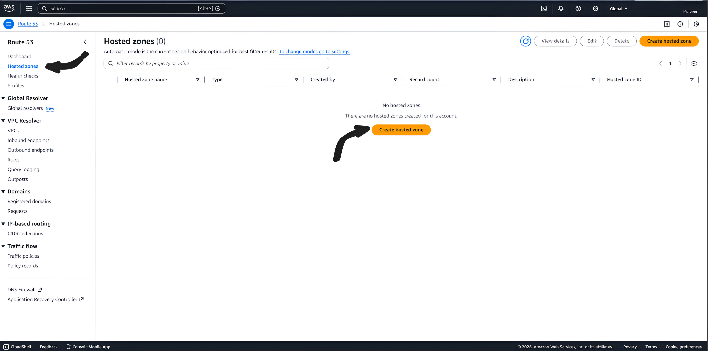
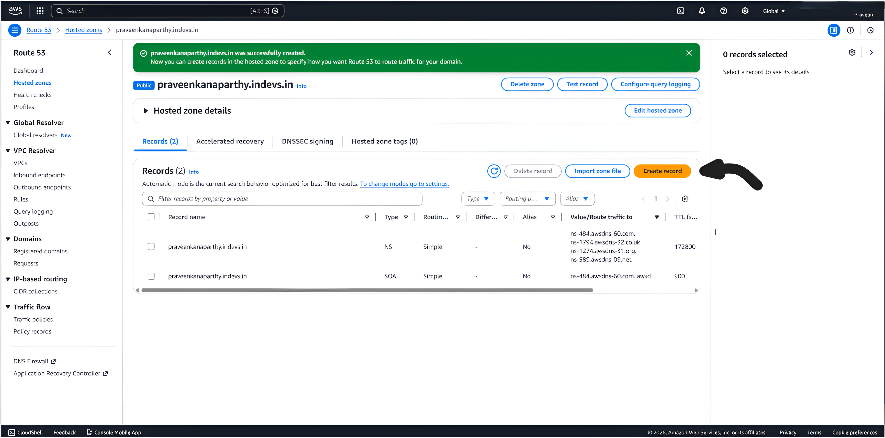
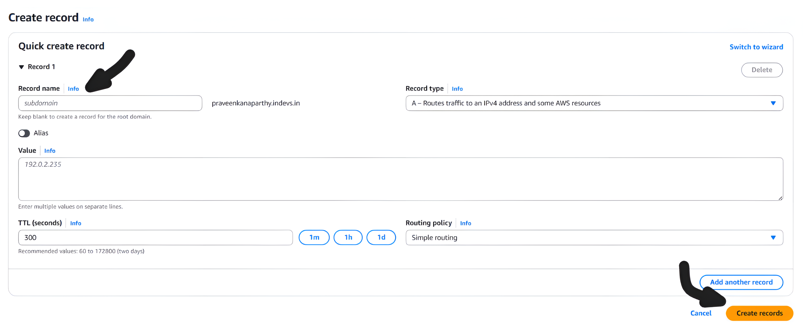

# AWS Route 53 DNS Setup for Stackryze Domains

> [!WARNING]
> These docs are in **Beta** and actively updated daily. Please report if you find any issues.

This guide shows you how to use AWS Route 53 as your DNS provider for your **Stackryze Domains** subdomain.

## Why Route 53?

- **Highly Reliable**: 100% uptime SLA with global DNS infrastructure
- **Advanced Routing**: Traffic flow, geolocation, and failover policies
- **Full Control**: Complete DNS record management
- **Scalable**: Enterprise-grade DNS for production workloads
- **AWS Integration**: Seamless integration with other AWS services

---

## Prerequisites

Before you begin:

- ✅ **Registered subdomain** on [domain.stackryze.com](https://domain.stackryze.com/)
- ✅ **AWS account** - [Sign up here](https://aws.amazon.com/)

> [!TIP]
> If you haven't registered your subdomain yet, see our [Getting Started](../getting-started) guide first.

> [!NOTE]
> Route 53 is a paid service. Hosted zones cost $0.50/month plus query charges. See [AWS pricing](https://aws.amazon.com/route53/pricing/) for details.

---

## Step 1: Login to AWS and Navigate to Route 53

1. Log in to your [AWS Console](https://console.aws.amazon.com/)
2. On the AWS Dashboard, use the **search bar** at the top
3. Search for **"Route 53"** and click on the service

[](../media/Route53/Route53_step_1.png)

---

## Step 2: Navigate to Hosted Zones

1. After opening the Route 53 dashboard, navigate to **"Hosted zones"** in the left sidebar
2. Click on **"Hosted zones"**
3. Click **"Create hosted zone"** button

[](../media/Route53/Route53_step_2.png)

---

## Step 3: Register Your Domain and Create Hosted Zone

1. Enter your **full subdomain** (e.g., `yourname.indevs.in`)
2. Fill in the details as per your preferences:
   - **Domain name**: Your complete subdomain from Stackryze
   - **Type**: Select **Public Hosted Zone**
   - **Description** (optional): Add a description for your hosted zone
3. Click **"Create hosted zone"**

[](../media/Route53/Route53_step_3.png)

> [!IMPORTANT]
> Make sure to enter your complete subdomain from Stackryze Domains (e.g., `myproject.indevs.in`), not just the base domain.

---

## Step 4: Copy Your Nameservers

After creation, Route 53 assigns four nameservers:

1. Look for the **NS** (Name Server) record in your hosted zone
2. You'll see four nameservers like:
   ```
   ns-123.awsdns-45.com
   ns-678.awsdns-90.net
   ns-1234.awsdns-56.org
   ns-5678.awsdns-12.co.uk
   ```
3. **Copy all four nameservers** - you'll need them in the next step

[](../media/Route53/Route53_step_4.png)

> [!WARNING]
> Your nameservers will be different from this example. Copy the exact ones AWS assigns to you.

---

## Step 5: Update Nameservers in Stackryze Domains

Now add the Route 53 nameservers to your Stackryze domain:

1. Log in to [domain.stackryze.com](https://domain.stackryze.com/)
2. Update nameservers with your Route 53 nameservers
3. Click **"Save"**

> [!TIP]
> For detailed instructions, see [Updating Nameservers](../managing-domains#updating-nameservers) guide.

> [!IMPORTANT]
> DNS changes will be updated within 24-48 hours globally.

---

## Step 6: Create a Record

Now add your DNS records in Route 53:

1. In Route 53, select your **hosted zone**
2. Click **"Create record"** button as shown in the image

[](../media/Route53/Route53_step_6.1.png)

3. Select your preferred **record type** and fill in the details:
   - **Record name**: `@` (for root domain) or your subdomain name
   - **Record type**: Choose based on your needs (A, CNAME, AAAA, MX, etc.)
   - **Value**: Your target value (IP address, domain name, etc.)
   - **TTL**: `300` (5 minutes) or your preferred value
   - **Routing policy**: Simple routing (or choose advanced policy)
4. Click **"Create records"**

[](../media/Route53/Route53_step_6.2.png)

**That's it! All steps are done.** 🎉

> [!TIP]
> **Common Record Types:**
> - **A Record**: Points to an IPv4 address (e.g., `192.0.2.1`)
> - **CNAME Record**: Points to another domain (e.g., `yourusername.github.io`)
> - **AAAA Record**: Points to an IPv6 address
> - **MX Record**: For email routing
> - **TXT Record**: For verification and SPF records

> [!NOTE]
> Route 53 supports advanced routing policies like weighted, latency-based, failover, and geolocation routing.

---

## SSL Configuration

**SSL Handling:**
- Route 53 provides DNS services only
- SSL certificates must be managed by your hosting provider or AWS services

**For Common Hosting Platforms:**
- **Vercel/Netlify**: Automatic SSL provisioning
- **GitHub Pages**: Automatic SSL after DNS verification
- **AWS Services (CloudFront, ALB, API Gateway)**: Use AWS Certificate Manager (ACM) for free SSL
- **Custom Server**: Use Let's Encrypt or commercial certificates

> [!TIP]
> Most modern hosting platforms provide free automatic SSL certificates once DNS is configured. ACM certificates are free when used with AWS services and renew automatically.

---

## Common Issues

### Hosted Zone Not Created

**Solution**:
- Verify you have proper AWS permissions (IAM)
- Check that you selected "Public Hosted Zone"
- Ensure subdomain format is correct

### DNS Not Resolving

**Solution**:
- Verify nameservers are correctly updated in your Stackryze dashboard
- Wait 10-30 minutes for DNS propagation
- Check DNS records in Route 53 hosted zone
- Use [DNS Checker](https://dnschecker.org/) to verify
- Ensure all four nameservers are entered correctly

### High Costs

**Solution**:
- Review Route 53 pricing before use
- Monitor query volume in CloudWatch
- Consider using Route 53 only for production domains
- Use free DNS providers for development/testing

---

## Advanced Features

- **Traffic Flow**: Visual traffic policy editor
- **Health Checks**: Monitor endpoint availability
- **Routing Policies**: Weighted, latency, geolocation, failover
- **DNSSEC**: Domain Name System Security Extensions
- **Query Logging**: Log DNS queries to CloudWatch

---

## Additional Resources

- [Route 53 Documentation](https://docs.aws.amazon.com/route53/)
- [Route 53 Pricing](https://aws.amazon.com/route53/pricing/)
- [AWS Certificate Manager](https://aws.amazon.com/certificate-manager/)
- [DNS Propagation Checker](https://dnschecker.org/)

---

**Need help?** [Join our Discord](https://discord.gg/wr7s97cfM7) for live help or contact us at [support@stackryze.com](mailto:support@stackryze.com)
