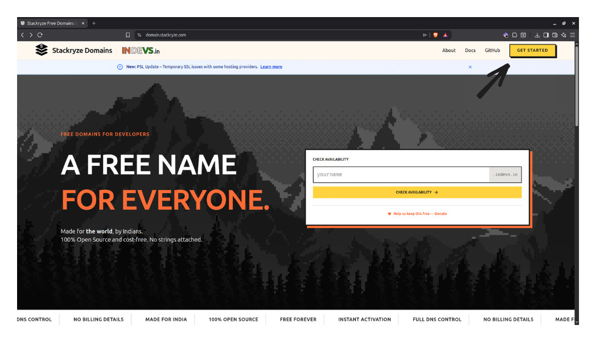
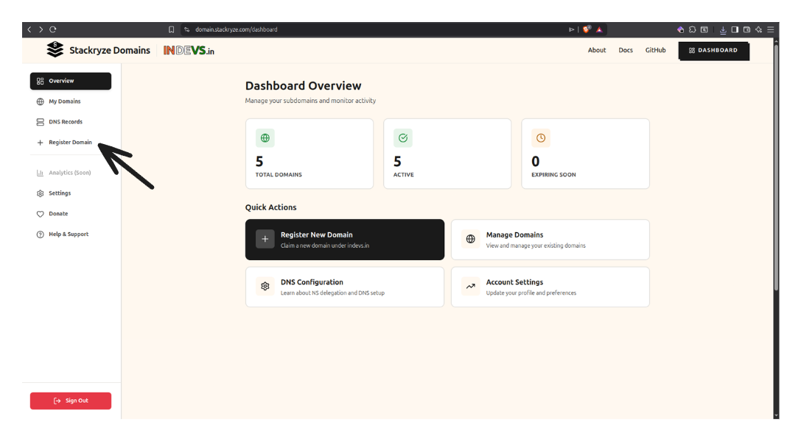
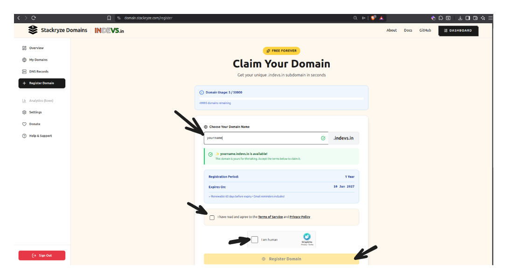

# Getting Started with Stackryze Domains

> [!WARNING]
> These docs are in **Beta** and actively updated daily. Please report if you find any issues.

This guide walks you through creating your account and registering your first subdomain on **Stackryze Domains**.

> [!NOTE]
> Currently offering: **indevs.in** subdomains. More domains coming soon!

---

## Step 1: Visit the Registration website

1. Go to **[https://domain.stackryze.com/](https://domain.stackryze.com/)**
2. Click the **"Get Started"** button on the landing page

---

## Step 2: Create an Account

### Option A: Sign up with Email (Recommended)
1. Click **"Get Started"** or **"Register"**.
2. Enter your **Name**, **Email**, and a secure **Password**.
3. Complete the security check (Turnstile).
4. Click **"Create Account"**.
5. You will see a verification screen. Check your email for a **6-digit code**.
6. Enter the code to verify your account.

> [!TIP]
> **Didn't receive the code?** Click the "Resend" button on the verification page to get a new code.

### Option B: Login with GitHub
> [!IMPORTANT]
> **New GitHub registrations are currently paused.**
> To use GitHub login, you must **first create an account with Email/Password** (using the same email address as your GitHub account). Once registered, you can link your GitHub account by logging in with it.

If you already have an account:
1. Click **"Login"**.
2. Select the **"GitHub"** tab.
3. Authenticate with GitHub.

### Account Protection
To keep your account secure, we have implemented the following protections:
- **Email Verification**: Required for all new accounts.
- **Account Lockout**: After **5 failed login attempts**, your account will be **locked for 30 minutes**. This prevents brute-force attacks.

**Note on Passwords:**
If you set a password, ensure it is strong (min 8 characters).

---

## Step 3: Navigate to Register Domain

After logging in, click **"Register Domain"** from the sidebar menu

---

## Step 4: Complete the Registration Form

Now fill out the registration form:

### 1. Enter Your Subdomain Name

Type your desired subdomain name in the input field.

**Guidelines:**
- **Length**: 3-63 characters
- **Characters**: Lowercase letters, numbers, and hyphens only
- **Format**: Cannot start or end with a hyphen

**Examples:**
- ✅ `myproject` → `myproject.indevs.in`
- ✅ `john-portfolio` → `john-portfolio.indevs.in`
- ❌ `ab` (too short)
- ❌ `-myproject` (starts with hyphen)

### 2. Check Availability

The system automatically checks availability as you type:
- 🟢 **Green checkmark** - Domain is available!
- 🔴 **Red X** - Domain is taken or invalid

### 3. Accept Terms of Service

Check the box to accept the [Terms of Service](https://domain.stackryze.com/terms) and [Privacy Policy](https://domain.stackryze.com/privacy)

### 4. Complete CAPTCHA

Complete the hCaptcha verification to prove you're human

### 5. Click "Register Domain"

Click the **"Register Domain"** button to complete registration

**What Happens Next:**
- ✅ Your domain is **registered immediately**
- ✅ DNS delegation is **automatically configured**
- ✅ Domain is valid for **1 year**
- ✅ You'll see a success message

---

## Step 5: Success!

Congratulations! Your domain is now registered and active.

**What's next?**
- View your domain in [My Domains](https://domain.stackryze.com/my-domains)
- Set up DNS records with your DNS provider
- Learn how to manage your domain (renew, update nameservers, delete)

[Managing Domains Guide →](managing-domains)

---

## Domain Limits

You can register up to **5 domains** by default. Domain names must be 3-63 characters long.

[View all limits and quotas →](managing-domains#domain-limits--quotas)

---

## Having Issues?

If you encounter any problems during registration:

- 🔧 [**Troubleshooting Guide**](troubleshooting) - Solutions for common login and registration errors
- 💬 [**Discord Community**](https://discord.gg/wr7s97cfM7) - Live help (Faster than email!)
- 📧 [**Email Support**](mailto:support@stackryze.com) - Contact us for help
- 💬 [**Report a Bug**](https://github.com/stackryze/domains-docs/issues) - Technical issues

---

## Next Steps

Now that you've registered your domain:

1. **Set up DNS** - Configure your DNS provider
   - [Cloudflare Setup](dns-providers/cloudflare) - Recommended, free
   - [View all DNS providers](dns-providers)

2. **Manage your domain** - Update nameservers, renew, or delete
   - [Managing Domains Guide](managing-domains)

3. **Get help** - Questions or issues?
   - [FAQ](faq) - Frequently asked questions
   - [Troubleshooting](troubleshooting) - Common issues
   - [Support](mailto:support@stackryze.com) - Contact us

---

**Ready to get started?** Visit [domain.stackryze.com](https://domain.stackryze.com/) and register your first domain today!
