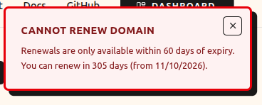

# Managing Your Domains

> [!WARNING]
> These docs are in **Beta** and actively updated daily. Please report if you find any issues.

Learn how to manage your registered domains, update nameservers, renew, and delete domains.

---

## Accessing Your Domains

1. Sign in at [domain.stackryze.com](https://domain.stackryze.com/)
2. Click **"My Domains"** from the sidebar

You'll see all your registered domains with their current status, expiry date, and nameservers.

---

## Domain Overview

Each domain shows:

- **Domain Name** - Your subdomain (e.g., `yourname.indevs.in`)
- **Status** - Active, Expiring Soon, or Expired
- **Registered On** - When you registered the domain
- **Expiry Date** - When the domain expires
- **Registration Period** - Current validity period (1 Year Fixed)
- **DNS Configuration** - Current nameservers


---

## Updating Nameservers

To change your DNS provider:

### Step 1: Get Your New Nameservers

Set up your DNS provider first:
- [Cloudflare](dns-providers/cloudflare) - Recommended, free
- [AWS Route 53](dns-providers/route53)
- [Google Cloud DNS](dns-providers/google-cloud-dns)
- [View all providers](dns-providers)

### Step 2: Update in Dashboard

1. Go to **[My Domains](https://domain.stackryze.com/my-domains)**
2. Click the **"Manage"** button for your domain
3. In the DNS Configuration section, click **"Edit"**
4. Replace the default nameservers (`ns1.stackryze.com`, `ns2.stackryze.com`) with your new ones:
   - **Primary Nameserver**: `ns1.example.com`
   - **Secondary Nameserver**: `ns2.example.com`
5. Click **"Save"**

> [!NOTE]
> DNS changes propagate in 5-10 minutes but can take up to 48 hours globally.

### Step 3: Verify DNS Propagation

Check if your nameservers updated:

```bash
dig NS yourname.indevs.in
```

Or use online tools:
- [DNS Checker](https://dnschecker.org/)
- [What's My DNS](https://www.whatsmydns.net/)

---

## Renewing Domains

Domains are valid for **1 year** from registration.

### When Can I Renew?

- Renewal opens **60 days before expiry**
- You'll receive email reminders at:
  - 60 days before expiry
  - 10 days before expiry

### How to Renew

1. Go to **[My Domains](https://domain.stackryze.com/my-domains)**
2. Find your domain in the list
3. Click the **"Renew"** button (green button on the right)
4. Confirm renewal
5. Expiry date extends by 1 year


> [!TIP]
> Renewal is **100% free**! There's no cost to extend your domain.

> [!NOTE]
> If you click "Renew" before the 60-day window, you'll see a message showing how many days until renewal is available.



### What If I Don't Renew?

| Timeline | What Happens |
|----------|--------------|
| **Day 0** | Domain expires (status updates to "Expired" automatically) |
| **Days 1-15** | Grace period - domain still works, DNS remains active |
| **Day 15** | Domain is soft-deleted, DNS records removed |
| **Days 15-22** | Cooling-off period (7 days) - name cannot be registered by anyone |
| **Day 22+** | Name becomes available for registration again |

> [!IMPORTANT]
> - You can **only** renew the domain during the 15-day grace period.
> - Once the grace period ends (Day 15), the domain is deleted and cannot be renewed.

---

## Deleting Domains

If you no longer need a domain, you can delete it from the **Danger Zone**.

### How to Delete

1. Scroll to the **"Danger Zone"** section at the bottom
2. Click **"Delete Domain"** button
3. Confirm deletion

> [!CAUTION]
> **DNS records are removed immediately.** Your domain will stop working right away.

### Cooling-Off Period

After deletion:

- **7-day cooling-off period** begins immediately
- Name cannot be registered by you or others during this time
- **Deletion is permanent** - domains cannot be restored once deleted

> [!WARNING]
> Once you delete a domain, it enters a **7-day cooling-off period**. After 7 days, the name becomes available for anyone to register. **Restoration is not possible.**

---

## Domain Status Types

| Status | Description |
|--------|-------------|
| **Active** | Domain is working normally |
| **Expiring Soon** | Less than 60 days until expiry |
| **Expired** | Domain has expired but is in grace period (1-15 days) |
| **Pending Deletion** | Scheduled for deletion |
| **Deleted** | Removed from DNS (Cooling off for 7 days) |
| **Pending DNS** | waiting for DNS records to be created (automatic retry) |

---

## Activity History

Track all changes to your domains:

1. Click **"History"** from the sidebar
2. View complete audit log of:
   - Domain registrations
   - Nameserver updates
   - Renewals
   - Deletions and restorations
   - Login events

---

## Domain Limits & Quotas

### Default Limits

- **Domains per account**: 5
- **Domain length**: 3-63 characters
- **Nameservers required**: Minimum 2
- **Renewal window**: 60 days before expiry
- **Grace period**: 15 days after expiry
- **Cooling-off period**: 7 days after deletion

### Need More Domains?

Email [support@stackryze.com](mailto:support@stackryze.com) with:
- Your GitHub username
- Reason for increase
- How many domains you need

We'll review and respond within 1-2 business days.

---

## Common Issues

### Nameservers Not Updating

**Solution:**
1. Wait 5-10 minutes for propagation
2. Clear DNS cache: `sudo systemd-resolve --flush-caches` (Linux)
3. Verify nameservers are correct in dashboard
4. Check with [DNS Checker](https://dnschecker.org/)

### Domain Not Resolving

**Solution:**
1. Verify nameservers in dashboard
2. Check DNS records in your DNS provider
3. Ensure DNS zone is configured correctly
4. Wait up to 48 hours for global propagation

### Can't Renew Domain

**Solution:**
- You can only renew 60 days before expiry
- Check your domain's expiry date
- If expired, check if it's in the 15-day grace period

### Accidentally Deleted Domain

**Solution:**
1. Wait for the **7-day cooling-off period** to complete
2. Re-register the domain once it becomes available
3. **Note:** Deletions are permanent and cannot be undone by support.

---

## Best Practices

### Regular Maintenance

- Check your domains monthly
- Set calendar reminders for renewal (60 days before expiry)
- Keep your email updated for notifications
- Monitor activity history for unauthorized changes

### DNS Configuration

- Use a reliable DNS provider (Cloudflare recommended)
- Configure proper DNS records (A, CNAME, MX, TXT)
- Test your domain after any changes
- Keep nameservers backed up

### Security

- Enable GitHub 2FA for account security
- Review activity history regularly
- Don't share account credentials
- Report suspicious activity to [security@stackryze.com](mailto:security@stackryze.com)

---

## Need Help?

- [Troubleshooting](troubleshooting) - Solutions for common issues
- [Getting Started](getting-started) - Register your first domain
- [DNS Providers](dns-providers) - Setup guides for popular providers
- [Discord Community](https://discord.gg/wr7s97cfM7) - Live help
- [Support](mailto:support@stackryze.com) - Contact us
- [GitHub Issues](https://github.com/stackryze/domains-docs/issues) - Report bugs
